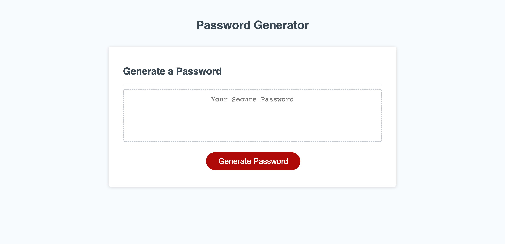

# 03-Challenge

## Description

The 03-Challenge project involved refactoring javascript starter code to generate a password based on user selected criteria.

The generator first prompts the user to enter a length for the password, alerting the user if the length or input type is invalid. After a valid length is chosen, the generator asks the user to confirm which character types to include in the password (lowercase, uppercase, numeric, special character). The user is required to select at least one character input. If the user does not select one character type, they are alerted and sent back to the original prompt.

After all criteria is selected, the generator outputs a password.

## Mock Up

The following image shows the password generator's appearance and functionality:

## Link

https://swaguespack.github.io/03-challenge/